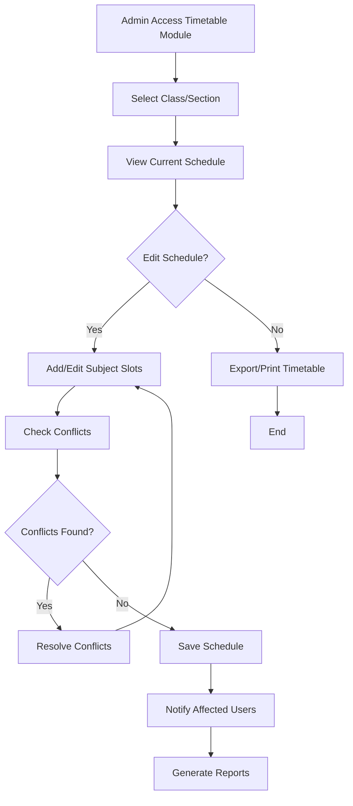
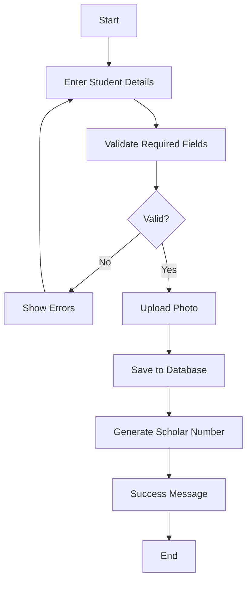
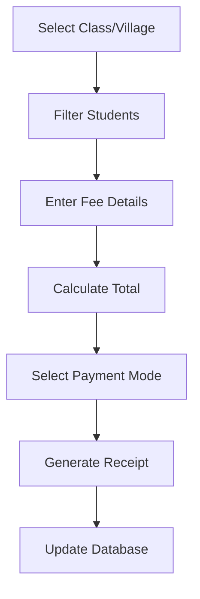
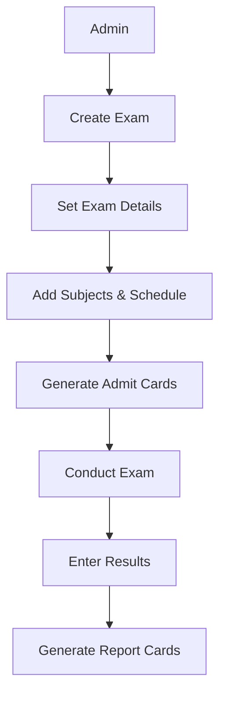
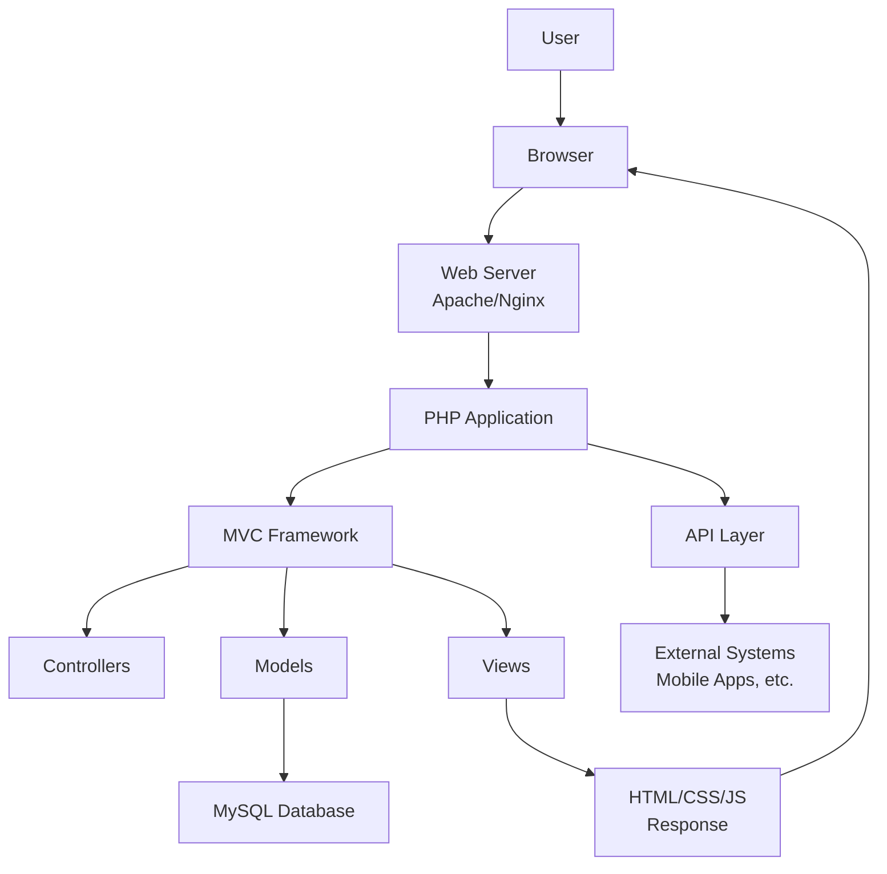
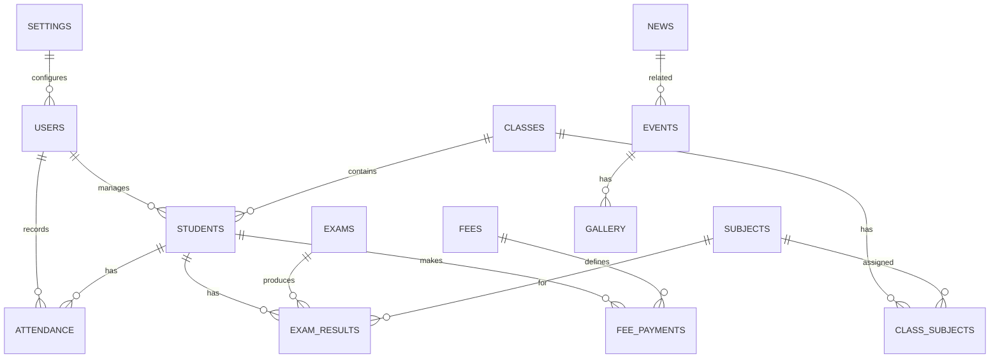

# 🎓 School Management System

A comprehensive, modern, and feature-rich School Management System built with PHP, designed to streamline educational institution operations and enhance the learning experience for students and administrators.

## 📖 Overview

The School Management System is a comprehensive web-based application designed to manage all aspects of educational institution operations. It provides role-based access for administrators and students, with features spanning student management, attendance tracking, examination systems, fee management, and more.

### Key Features
- **Multi-Role Support**: Separate dashboards for Admin and Student roles
- **Complete Academic Management**: Student enrollment, class management, attendance, examinations, promotion system, and timetable management
- **Document Generation**: Automated generation of Transfer Certificates, marksheets, and admit cards with integrated print system
- **Financial Management**: Fee collection, payment tracking, and financial reporting
- **Content Management**: Dynamic website with news, events, and gallery management
- **Reporting System**: Comprehensive reports with PDF/Excel export capabilities
- **Timetable Management**: Automated class scheduling, conflict resolution, teacher availability tracking, and integration with attendance and exam systems

### Technology Stack
- **Backend**: PHP 8.1+ with MVC architecture
- **Database**: MySQL 8.0+ with optimized schema
- **Frontend**: Bootstrap 5 (predefined CSS files in [`css/`](css/), JS files in [`js/`](js/)), HTML5, CSS3, JavaScript, AJAX
- **Security**: CSRF protection, role-based access control, input validation

## 📋 Project Requirements

### 🎨 User Interface & Frontend

#### Homepage Requirements
Create a dynamic school website homepage with sections like Header, Image Carousel, About, Courses, Events, Achievements, Gallery, Testimonials, CTA, and Footer. All content must be managed through an Admin Panel, with data stored in a MySQL database. The Admin Panel should allow adding, editing, and deleting homepage content such as carousel images, events, courses, gallery photos, and contact info. The homepage should load data dynamically via PHP APIs and AJAX.

#### Login System Requirements
Create a Login Page for a school management system with fields for Username/Email and Password, including validation, 'Remember Me', and 'Forgot Password' options. Implement role-based redirection so Admin and Student each land on their respective dashboards after login. Use MySQL with PHP for backend authentication, hashed passwords for security, and AJAX with API for smooth login without page reloads. The design should be responsive and styled using Tailwind + Bootstrap, with dynamic error and success messages.

#### Header Navigation Requirements
Design a modern admin panel header for a school management system. The header must include the school logo, navigation menu for Dashboard, Students, Classes, Attendance, Exams, Fees, Events, Gallery, and Settings. On the right side, show an Admin profile dropdown with Profile, Change Password, and Logout options. Each module page should have its own header with the module title, breadcrumb navigation, a search bar, and quick action buttons (like Add, Edit, Export). The design should be responsive, using Tailwind + Bootstrap styles, with dynamic data managed by MySQL and editable from the Admin Panel.

#### Sidebar Menu Requirements
Create a responsive admin panel menu for a school management system. The menu should be a collapsible sidebar with icons and text. It must include links for Dashboard, Students, Classes & Subjects, Attendance, Exams & Results, Fees, Events, Gallery, Reports, and Settings. Each item should have submenus where required. The active page should be highlighted. Menu data (titles, icons, links, visibility) should be stored in a MySQL database and controlled by the Admin Panel with role-based permissions. On mobile view, the menu should collapse into a drawer. At the bottom, include an Admin user profile section with Profile, Change Password, and Logout options.

### 🔐 Security & Authentication

#### Role-Based Permission System
Create a role-based permission system for a school management system with two roles: Admin and Student. Admin has full access to all modules including user management, students, classes, attendance, exams, fees, events, gallery, reports, and settings. Students have read-only access to their own attendance, results, fees, profile, and announcements. All permissions must be stored in a MySQL database, with the ability to edit roles and permissions from the Admin Panel.

### 👤 User Management Modules

#### Admin Panel Requirements
Create an Admin Panel for a school management system with the following pages: Dashboard, Students, Classes & Subjects, Attendance, Exams & Results, Fees, Events & Announcements, Gallery, Reports, and Settings. Each page should support CRUD operations and display data in dynamic tables with filters and search options. The Dashboard must include graphs and quick stats. The Students, Classes, Attendance, Exams, and Fees pages must allow full data management with import/export support. The Events, Gallery, and Homepage content must sync with the public website dynamically. The Reports page should allow exporting data to PDF and Excel. The Settings page must provide user management, permissions, school info, homepage customization, and API security options. All data should be stored in MySQL and controlled via Admin Panel.

### 📊 Detailed Module Specifications

#### Admin Module Features
- **Dashboard Overview**: Central hub displaying key statistics, graphs, charts, and notifications with quick action buttons for immediate access to add new entities.

- **Student Management**: Complete CRUD operations with searchable/filterable table views, individual profile pages, and bulk import/export capabilities including ID card generation.


- **Academic Structure**: Class and section organization, subject assignments, and optional timetable management for structured daily schedules.

- **Attendance System**: Daily attendance marking (Present/Absent/Late), bulk CSV/Excel uploads, detailed reporting, and graphical trend analysis.

- **Examination Management**: Exam creation with categories (mid-term, final, custom), subject assignment, automatic grade calculation, and PDF report card generation.

- **Financial Management**: Fee structure definition, payment recording (cash/online/cheque), receipt generation, pending fee tracking, and comprehensive financial reporting.

- **Content Management**: Event posting with calendar integration, gallery management with bulk uploads and categorization, and homepage synchronization.

- **Analytics & Reporting**: Comprehensive reports with customizable date ranges, PDF/Excel export, and data analysis for auditing and planning.

- **System Configuration**: School information updates, user account management, permission control, and system settings with backup/restore options.

#### Timetable Management System

**Features:**
- Automated class scheduling with drag-and-drop interface
- Conflict resolution for overlapping classes or teacher assignments
- Teacher availability tracking and workload balancing
- Integration with attendance marking and exam scheduling
- Printable timetables with PDF export
- Real-time updates and notifications for schedule changes
- Customizable time slots and break periods
- Mobile-responsive design for on-the-go access

**Workflow:**



**Components:**
1. **Schedule Builder**: Interactive grid for creating weekly/monthly timetables
2. **Conflict Detector**: Automatic identification of scheduling conflicts
3. **Teacher Dashboard**: Personal schedule view with availability settings
4. **Student Portal**: Class timetable access with notifications
5. **Admin Controls**: Bulk operations, template management, and audit logs

#### Student Portal Features
- **Academic Dashboard**: Personal academic snapshot showing attendance percentage, exam results, upcoming events, and fee status with relevant notifications.

- **Profile Management**: View personal academic and contact details with guardian information, class assignments, and subject lists (read-only access).

- **Academic Records**: Access attendance history with detailed tracking, exam schedules, marks, grades, and downloadable report cards.

- **Financial Overview**: View fee payment history, pending dues, deadlines, and payment receipts with online payment integration options.

- **School Events**: Access school events, announcements, and media gallery with approved content management.

- **Account Settings**: Manage personal preferences and account security with password change functionality and locked personal data protection.

### 📝 Form Specifications
#### Student Registration Form

### Student Admission Workflow



**Required Fields:**
- Scholar Number, Admission Number, Admission Date, Full Name (first, middle, last), Class & Section (dropdown)
- Father's Name, Mother's Name, Guardian's Name & Contact Number, Date of Birth, Gender
- Caste/Category, Nationality, Religion, Blood Group, Village/Address, Permanent/Temporary Address
- Mobile Number, Email ID, Aadhar Number, Samagra Number, Apaar ID, PAN Number, Previous School Name
- Medical Conditions, Student Photo Upload

**Features**: Mandatory field validation, MySQL storage, responsive design (Tailwind + Bootstrap), Save/Reset buttons

#### Fee Collection Form

### Fee Collection Workflow



**Features:**
- Class and Village filtering with dynamic student population
- Fee Details: Total Fee, Fee Type, optional Discount/Scholarship, Receipt Number
- Payment Modes: Cash, Online, Cheque, UPI with Transaction/Cheque number
- Payment Date and Remarks fields
- MySQL storage with fee status updates
- Triple receipt generation (School/Student/Accounts copy per A4 page)
- AJAX dynamic data fetching, responsive design

#### Expense Management Module
**Features:**
- Expense Record Form: Receipt Number, Reason, Category (Diesel/Staff/Bus/Maintenance/Misc/Custom)
- Amount, Payment Date, optional Remarks
- MySQL storage with data validation
- Expense Report Page: Filter by Category, Date Range, Amount Range
- Summary tables with category totals
- Print/export options (PDF/Excel)
- Category-wise spending trend graphs
- Role-based permissions (Admin access only)

#### Admit Card Generation System
**Features:**
- Bulk (class-wise) and individual admit card generation
- Display Elements: School Name & Logo, Exam Name, Student Details, Subject Schedule Table
- Signature Areas: Principal, Exam Controller, School Seal
- Multiple printing support (2-4 cards per A4 page) with integrated bulk and single print system
- PDF export capability
- Dynamic MySQL data fetching via AJAX
- Responsive Tailwind + Bootstrap design

#### Subject Schedule Management System
**Features:**
- Exam Name and Class/Section selection interface
- Dynamic table for subject entry with fields: Subject Name, Exam Date, Day, Start Time, End Time
- CRUD operations: Add, Edit, Delete subjects
- Automatic Admit Card module integration
- Print/export functionality (PDF/Excel)
- Field validation and AJAX operations
- Responsive design implementation
#### Complete Examination Module

### Exam Management Workflow



**Components:**
1. **Exam Setup Page**: Create/manage examinations with Exam Name, Type, Class/Section, Start/End Date fields
2. **Subject Schedule Management**: Define exam subjects with dates and timings (Add/Edit/Delete operations)
3. **Admit Card Generation**: Individual and bulk admit card creation with signature areas and PDF export
4. **Role-Based Permissions**: Admin full access
5. **Technology**: Responsive design with Tailwind + Bootstrap, AJAX data fetching

#### Transfer Certificate Generation System
**Features:**
- Bulk (class-wise) and individual TC generation
- Display Elements: School Name & Logo, Student Details, Academic Record, Transfer Reason, Issue Date
- Signature Areas: Principal, Class Teacher, School Seal
- Multiple printing support (1-2 certificates per A4 page)
- PDF export capability
- Dynamic MySQL data fetching via AJAX
- Responsive Tailwind + Bootstrap design

#### Marksheet Generation System
**Features:**
- Bulk (class-wise) and individual marksheet generation
- Display Elements: School Name & Logo, Student Details, Subject-wise Marks, Grades, Total Score, Percentage, Rank
- Signature Areas: Principal, Class Teacher, Exam Controller
- Multiple printing support (1-2 marksheets per A4 page)
- PDF export capability
- Dynamic MySQL data fetching via AJAX
- Responsive Tailwind + Bootstrap design

### 👤 User Profile Management System

#### Multi-Role Profile Architecture
**Admin Profiles**: Display name, email, phone, role, photo, login activity, system permissions, and configuration access.

**Student Profiles**: Comprehensive academic records with scholar number, parents' names, DOB, identification documents (Aadhaar/Samagra/Aapaar/PAN), class/section/roll information, fee status, results, and attendance data.

#### Profile Features
- Profile picture upload functionality
- Password change options with security validation
- Activity logging for all profile changes
- Dynamic MySQL data fetching via AJAX
- Responsive Tailwind + Bootstrap design
- Role-based data visibility and editing permissions

### 🗄️ Database Implementation

#### Real-Time Database Creation
- Terminal-based database setup procedures
- Comprehensive .sql schema file generation
- MySQL 8.0+ compatibility and optimization
- Real-time database operations and management
- Backup and migration support procedures

## 🏗️ System Architecture

### High-Level System Architecture

The following diagram illustrates the high-level architecture of the School Management System:



### MVC Architecture
The system follows the Model-View-Controller (MVC) pattern for clean separation of concerns:
- **Models**: Handle database operations and business logic
- **Views**: Manage presentation layer and user interface
- **Controllers**: Process user requests and coordinate between models and views

### API Layer
- RESTful API endpoints for mobile and external integrations
- JSON responses for seamless data exchange
- AJAX-powered dynamic content loading

### Security Architecture
- Role-based access control (RBAC) system
- CSRF protection on all forms
- Input validation and sanitization
- Secure session management with timeout
- Rate limiting for API endpoints

## 🔧 Core Modules

### 👥 User Management System
- **Multi-Role Support**: Admin and Student roles
- **Authentication**: Secure login with hashed passwords
- **Authorization**: Granular permissions per role
- **Profile Management**: User profile customization and settings

### 📚 Academic Management
- **Student Management**: Complete student lifecycle from admission to graduation
- **Class Management**: Class and section organization with subject allocation
- **Subject Management**: Curriculum management and subject scheduling
- **Student Promotion System**: Automated promotion logic based on academic performance criteria, with visual indicators (yellow highlighting for promoted students in current session display, automatic class advancement for next academic session)

### 📊 Attendance System
- **Daily Attendance**: Mark attendance for classes and individual students
- **Bulk Operations**: CSV/Excel import for attendance data
- **Reporting**: Attendance analytics and trend analysis
- **Notifications**: Automated alerts for attendance issues

### 📝 Examination System
- **Exam Setup**: Create and manage examinations with scheduling
- **Subject Scheduling**: Define exam dates, times, and subjects
- **Result Management**: Mark entry, grade calculation, and result publishing
- **Admit Cards**: Automated generation and printing of admit cards
- **Report Cards**: PDF generation with detailed performance reports

### 💰 Financial Management
- **Fee Structure**: Define fee categories and amounts per class
- **Payment Processing**: Multiple payment methods (cash, online, cheque)
- **Receipt Generation**: Automated receipt printing (3 copies per page)
- **Outstanding Tracking**: Monitor pending fees and send reminders
- **Financial Reports**: Comprehensive revenue and expense reporting

### 🖼️ Content Management System
- **Dynamic Website**: Public-facing school website with dynamic content
- **News & Events**: Post announcements and manage event calendar
- **Gallery Management**: Photo and video upload with categorization
- **Homepage Customization**: Admin-controlled website content

### 📈 Reporting & Analytics
- **Academic Reports**: Student performance and class-wise analytics
- **Financial Reports**: Revenue, expenses, and fee collection summaries
- **Attendance Reports**: Detailed attendance tracking and analysis
- **Custom Reports**: Filterable reports with PDF/Excel export

## 🗄️ Database Design

### Database Schema Overview



### Core Tables
- `users` - User accounts and authentication data
- `user_roles` - Role definitions and permissions
- `students` - Student personal and academic information
- `classes` - Class and section definitions
- `subjects` - Subject catalog and curriculum
- `class_subjects` - Subject assignments to classes

### Transaction Tables
- `attendance` - Daily attendance records
- `exams` - Examination definitions and schedules
- `exam_results` - Student marks and grades
- `fees` - Fee structure and payment records
- `fee_payments` - Payment transactions and receipts
- `expenses` - School expense tracking

### Content Tables
- `events` - School events and announcements
- `gallery` - Media files and categories
- `news` - News articles and updates
- `homepage_content` - Dynamic website content

### System Tables
- `audit_logs` - System activity tracking
- `settings` - System configuration
- `permissions` - Role-based access control

## 🛠️ Technical Specifications

### Server Requirements
- **PHP**: 8.1 or higher
- **MySQL**: 8.0 or higher
- **Web Server**: Apache 2.4+ or Nginx 1.18+
- **Disk Space**: Minimum 500MB for application and data

### PHP Extensions Required
- `pdo` & `pdo_mysql` - Database connectivity
- `mbstring` - Multi-byte string handling
- `curl` - HTTP requests and API calls
- `json` - JSON data processing
- `session` - Session management
- `openssl` - Encryption and security
- `gd` - Image processing
- `zip` - File compression

### Frontend Technologies
- **Bootstrap 5**: Responsive UI framework
- **jQuery**: DOM manipulation and AJAX
- **Chart.js**: Data visualization
- **DataTables**: Interactive tables with search/filter
- **Font Awesome**: Icon library

### Security Features
- **Password Hashing**: bcrypt algorithm for secure password storage
- **CSRF Protection**: Token-based prevention of cross-site request forgery
- **XSS Prevention**: Input sanitization and output escaping
- **SQL Injection Prevention**: Prepared statements and parameterized queries
- **Rate Limiting**: API request throttling
- **Session Security**: Secure session configuration with regeneration

### Performance Optimizations
- **Database Indexing**: Optimized queries with proper indexing
- **Caching**: File-based caching for frequently accessed data
- **Minification**: Compressed CSS and JavaScript files
- **Lazy Loading**: Images and content loaded on demand
- **CDN Support**: External resource loading optimization

### Print System
- **Bulk Printing**: Support for printing multiple documents (Transfer Certificates, marksheets, admit cards) on single pages to save paper and time
- **Single Printing**: Individual document printing options for specific requirements
- **PDF Generation**: TCPDF library integration for high-quality, printable PDF output
- **Print Optimization**: Automatic page layout, formatting, and scaling for efficient printing
- **Printer Compatibility**: Support for standard office printers, laser printers, and print-to-PDF functionality
- **Print Queue Management**: Batch processing for large print jobs with progress tracking


### Default Login Credentials

After installation, use these credentials to log in:

| Role | Username | Password | Dashboard |
|------|----------|----------|-----------|
| Admin | admin | admin123 | `/admin/dashboard` |
| Student | student1 | student123 | `/student/dashboard` |

**⚠️ Important:** Change all default passwords immediately after first login.

## 📁 Project Structure & File Organization

### Directory Structure Overview
```
school-management/
├── 🎯 Core Application Files
│   ├── index.php           # Main application entry point
│   ├── install.php         # Web-based installation wizard
│   ├── .htaccess          # Apache rewrite rules & security
│   └── composer.json      # PHP dependencies management
│
├── 🔧 Application Core (MVC Architecture)
│   ├── controllers/     # Request handlers
│   │   ├── admin/
│   │   │   ├── DashboardController.php
│   │   │   ├── StudentController.php
│   │   │   ├── ClassController.php
│   │   │   ├── AttendanceController.php
│   │   │   ├── ExamController.php
│   │   │   ├── FeeController.php
│   │   │   ├── EventController.php
│   │   │   ├── GalleryController.php
│   │   │   ├── ReportController.php
│   │   │   ├── SettingController.php
│   │   │   └── TimetableController.php
│   │   ├── student/
│   │   │   ├── DashboardController.php
│   │   │   ├── AttendanceController.php
│   │   │   ├── ResultController.php
│   │   │   ├── FeeController.php
│   │   │   ├── ProfileController.php
│   │   │   └── EventController.php
│   │   ├── public/
│   │   │   └── HomeController.php
│   │   ├── AuthController.php
│   │   └── ApiController.php
│   ├── models/         # Data layer
│   │   ├── user/
│   │   │   └── User.php
│   │   ├── student/
│   │   │   └── Student.php
│   │   ├── class/
│   │   │   └── Class.php
│   │   ├── subject/
│   │   │   └── Subject.php
│   │   ├── attendance/
│   │   │   └── Attendance.php
│   │   ├── exam/
│   │   │   └── Exam.php
│   │   ├── result/
│   │   │   └── Result.php
│   │   ├── fee/
│   │   │   └── Fee.php
│   │   ├── event/
│   │   │   └── Event.php
│   │   ├── gallery/
│   │   │   └── Gallery.php
│   │   ├── report/
│   │   │   └── Report.php
│   │   └── setting/
│       └── Setting.php
│   │   └── timetable/
│       └── Timetable.php
│   ├── views/          # Presentation layer
│   │   ├── admin/
│   │   │   ├── dashboard/
│   │   │   │   └── index.php
│   │   │   ├── students/
│   │   │   │   ├── index.php
│   │   │   │   ├── add.php
│   │   │   │   ├── edit.php
│   │   │   │   └── view.php
│   │   │   ├── classes/
│   │   │   │   ├── index.php
│   │   │   │   ├── add.php
│   │   │   │   └── edit.php
│   │   │   ├── attendance/
│   │   │   │   ├── index.php
│   │   │   │   ├── mark.php
│   │   │   │   └── report.php
│   │   │   ├── exams/
│   │   │   │   ├── index.php
│   │   │   │   ├── add.php
│   │   │   │   └── results.php
│   │   │   ├── fees/
│   │   │   │   ├── index.php
│   │   │   │   ├── collect.php
│   │   │   │   └── report.php
│   │   │   ├── events/
│   │   │   │   ├── index.php
│   │   │   │   ├── add.php
│   │   │   │   └── edit.php
│   │   │   ├── gallery/
│   │   │   │   ├── index.php
│   │   │   │   └── upload.php
│   │   │   ├── reports/
│   │   │   │   ├── index.php
│   │   │   │   └── generate.php
│   │   │   └── settings/
│   │       ├── index.php
│   │       ├── users.php
│   │       └── permissions.php
│   │   │   └── timetable/
│   │       ├── index.php
│   │       ├── create.php
│   │       └── edit.php
│   │   ├── student/
│   │   │   ├── dashboard/
│   │   │   │   └── index.php
│   │   │   ├── attendance/
│   │   │   │   └── index.php
│   │   │   ├── results/
│   │   │   │   └── index.php
│   │   │   ├── fees/
│   │   │   │   └── index.php
│   │   │   ├── profile/
│   │   │   │   ├── index.php
│   │   │   │   └── edit.php
│   │   │   └── events/
│   │       └── index.php
│   │   │   └── timetable/
│   │       └── index.php
│   │   └── public/
│       └── homepage/
│           ├── index.php
│           ├── about.php
│           ├── courses.php
│           ├── events.php
│           ├── gallery.php
│           ├── contact.php
│           └── admission.php
│   ├── core/           # Framework foundation
│   │   ├── Database.php     # Database abstraction
│   │   ├── Router.php        # URL routing
│   │   ├── Security.php      # Security utilities
│   │   ├── Session.php       # Session management
│   │   └── Validator.php     # Input validation
│   ├── middleware/     # Security & routing
│   ├── config/          # System configuration
│   │   ├── database.php          # Database settings
│   │   ├── app.php              # Application config
│   │   ├── security.php         # Security settings
│   │   ├── email.php            # Email configuration
│   │   └── upload.php           # File upload settings
│   ├── helpers/         # Utility functions
│   ├── libraries/       # Third-party integrations
│   └── logs/            # Application logs
│       ├── error.log          # Error logging
│       ├── access.log         # Access logging
│       └── audit.log          # Security audit
│
├── 🌐 Public Interface
│   ├── admin/            # Admin interface
│   ├── student/          # Student portal
│   └── public/           # Public website
│
├── 📱 Assets & Resources
│   ├── uploads/           # User uploads
│   ├── css/               # Stylesheets
│   ├── js/                # JavaScript files
│   ├── images/            # Static images
│   ├── fonts/             # Web fonts
│   └── plugins/           # Third-party plugins
│
├── 🗄️ Database & Migration Files
│   └── database/
│       ├── schema.sql           # Complete database structure
│       ├── migrations/          # Version-controlled changes
│       ├── seeders.php          # Sample data generation
│       ├── procedures.sql       # Stored procedures
│       └── triggers.sql         # Database triggers
│
├── 🌐 API & Web Services
│   ├── api/                    # RESTful API endpoints
│   │   ├── v1/                 # API version 1
│   │   │   ├── auth/           # Authentication endpoints
│   │   │   │   ├── login.php
│   │   │   │   ├── logout.php
│   │   │   │   └── token.php
│   │   │   ├── students/       # Student data API
│   │   │   │   ├── index.php
│   │   │   │   ├── create.php
│   │   │   │   ├── update.php
│   │   │   │   ├── delete.php
│   │   │   │   └── show.php
│   │   │   ├── fees/           # Fee management API
│   │   │   │   ├── index.php
│   │   │   │   ├── payment.php
│   │   │   │   └── report.php
│   │   │   ├── exams/          # Examination API
│   │   │   │   ├── index.php
│   │   │   │   ├── results.php
│   │   │   │   └── schedule.php
│   │   │   └── reports/        # Reporting API
│   │   │       ├── index.php
│   │   │       ├── export.php
│   │   │       └── analytics.php
│   │   └── docs/               # API documentation
│   │       └── index.php
│   ├── webhook/                # Webhook handlers
│   │   └── handler.php
│   └── sync/                   # Data synchronization
    └── sync.php
│
├── 🔍 Documentation & Testing
│   ├── docs/
│   │   ├── user-guide/        # User documentation
│   │   ├── developer/         # Developer documentation
│   │   ├── api/              # API documentation
│   │   └── deployment/       # Deployment guide
│   ├── tests/                 # Unit & integration tests
│   ├── .github/              # GitHub workflows
│   └── changelog.md          # Version history
│
└── 📦 Installation & Configuration
    ├── install/               # Installation scripts
    ├── setup/                 # Environment setup
    ├── backup/                # Backup utilities
    └── maintenance/           # Maintenance tools
```

### File Responsibility Matrix

#### Core Application Files
| File | Purpose | Type |
|------|---------|------|
| [`index.php`](index.php) | Application bootstrap and routing | Entry Point |
| [`install.php`](install.php) | Web-based installation wizard | Setup |
| [`.htaccess`](.htaccess) | Apache configuration and security | Configuration |
| [`composer.json`](composer.json) | PHP dependency management | Package |

#### Application Core Files
| Component | Primary Files | Responsibility |
|-----------|---------------|----------------|
| **Controllers** | [`controllers/admin/DashboardController.php`](controllers/admin/DashboardController.php), [`controllers/admin/StudentController.php`](controllers/admin/StudentController.php), [`controllers/student/DashboardController.php`](controllers/student/DashboardController.php), [`controllers/AuthController.php`](controllers/AuthController.php), [`controllers/ApiController.php`](controllers/ApiController.php) | Request handling and business logic |
| **Models** | [`models/user/User.php`](models/user/User.php), [`models/student/Student.php`](models/student/Student.php), [`models/fee/Fee.php`](models/fee/Fee.php), [`models/exam/Exam.php`](models/exam/Exam.php), [`models/attendance/Attendance.php`](models/attendance/Attendance.php) | Data operations and database interaction |
| **Views** | [`views/admin/dashboard/`](views/admin/dashboard/), [`views/admin/students/`](views/admin/students/), [`views/admin/classes/`](views/admin/classes/), [`views/admin/attendance/`](views/admin/attendance/), [`views/admin/exams/`](views/admin/exams/), [`views/admin/fees/`](views/admin/fees/), [`views/admin/events/`](views/admin/events/), [`views/admin/gallery/`](views/admin/gallery/), [`views/admin/reports/`](views/admin/reports/), [`views/admin/settings/`](views/admin/settings/), [`views/admin/timetable/`](views/admin/timetable/), [`views/student/dashboard/`](views/student/dashboard/), [`views/student/attendance/`](views/student/attendance/), [`views/student/results/`](views/student/results/), [`views/student/fees/`](views/student/fees/), [`views/student/profile/`](views/student/profile/), [`views/student/timetable/`](views/student/timetable/), [`views/public/homepage/`](views/public/homepage/) | Presentation and user interface |
| **Core** | [`Database.php`](core/Database.php), [`Router.php`](core/Router.php), [`Security.php`](core/Security.php), [`Session.php`](core/Session.php), [`Validator.php`](core/Validator.php) | Framework foundation |
| **Config** | [`database.php`](config/database.php), [`app.php`](config/app.php), [`security.php`](config/security.php), [`email.php`](config/email.php), [`upload.php`](config/upload.php) | System configuration |
| **Middleware** | [`Auth.php`](middleware/Auth.php), [`Security.php`](middleware/Security.php), [`RoleCheck.php`](middleware/RoleCheck.php) | Request processing and security |
| **Helpers** | [`functions.php`](helpers/functions.php), [`utilities.php`](helpers/utilities.php), [`form_helpers.php`](helpers/form_helpers.php) | Utility functions |
| **Libraries** | [`TCPDF.php`](libraries/TCPDF.php), [`PHPMailer.php`](libraries/PHPMailer.php), [`ChartJS.php`](libraries/ChartJS.php) | Third-party integrations |
| **Logs** | [`error.log`](logs/error.log), [`access.log`](logs/access.log), [`audit.log`](logs/audit.log) | Application logs |

#### Database Management Files
| File Type | File Name | Purpose |
|-----------|-----------|---------|
| Schema | [`schema.sql`](database/schema.sql) | Complete database structure |
| Migrations | Files in [`migrations/`](database/migrations/) | Version-controlled changes |
| Seeders | [`seeders.php`](database/seeders.php) | Sample data population |
| Procedures | [`procedures.sql`](database/procedures.sql) | Database stored procedures |
| Triggers | [`triggers.sql`](database/triggers.sql) | Automated database actions |

#### API & Integration Files
| Directory | Purpose | Endpoints |
|-----------|---------|-----------|
| [`api/v1/auth/`](api/v1/auth/) | Authentication API | Login, logout, tokens |
| [`api/v1/students/`](api/v1/students/) | Student data API | CRUD operations |
| [`api/v1/fees/`](api/v1/fees/) | Financial API | Payments, reports |
| [`api/v1/exams/`](api/v1/exams/) | Examination API | Results, schedules |
| [`api/v1/reports/`](api/v1/reports/) | Reporting API | Analytics, exports |

#### Assets & Resources Files
| Directory | Purpose | Key Files |
|-----------|---------|-----------|
| [`css/`](css/) | Bootstrap framework styles | [`bootstrap.min.css`](css/bootstrap.min.css), [`bootstrap-grid.css`](css/bootstrap-grid.css) |
| [`js/`](js/) | Bootstrap JavaScript | [`bootstrap.bundle.min.js`](js/bootstrap.bundle.min.js) |
| [`images/logos/`](images/logos/) | School logos | [`school-logo.png`](images/logos/school-logo.png), [`school-logo-small.png`](images/logos/school-logo-small.png) |
| [`images/icons/`](images/icons/) | Application icons | [`user-icon.png`](images/icons/user-icon.png), [`dashboard-icon.png`](images/icons/dashboard-icon.png) |
| [`images/backgrounds/`](images/backgrounds/) | Background images | [`login-bg.jpg`](images/backgrounds/login-bg.jpg), [`dashboard-bg.jpg`](images/backgrounds/dashboard-bg.jpg) |
| [`images/gallery/`](images/gallery/) | User gallery images | Dynamic user uploads |
| [`fonts/`](fonts/) | Custom web fonts | [`font-awesome.woff2`](fonts/font-awesome.woff2), [`custom-font.ttf`](fonts/custom-font.ttf) |
| [`uploads/`](uploads/) | User uploads | Dynamic user files |
| [`templates/`](templates/) | Email and report templates | [`email-template.html`](templates/email-template.html), [`report-template.html`](templates/report-template.html) |
| [`reports/`](reports/) | Report templates | [`student-report.pdf`](reports/student-report.pdf), [`fee-report.pdf`](reports/fee-report.pdf) |
| [`exports/`](exports/) | Export templates | [`excel-template.xlsx`](exports/excel-template.xlsx), [`csv-template.csv`](exports/csv-template.csv) |

## 🎨 Frontend Architecture & Functions

### Frontend Technology Stack
- **HTML5**: Semantic markup and accessibility
- **CSS3**: Advanced styling with animations and transitions
- **JavaScript (ES6+)**: Modern JavaScript with async/await and modules
- **Bootstrap 5**: Responsive grid system and components
- **Tailwind CSS**: Utility-first CSS framework
- **jQuery**: DOM manipulation and AJAX requests
- **Chart.js**: Interactive data visualizations
- **DataTables**: Advanced table functionality with search/filter
- **Font Awesome**: Comprehensive icon library

### Frontend Functions & Features

#### Core JavaScript Functions
- **Authentication Functions**: [`loginUser()`](js/modules/auth.js:loginUser), [`logoutUser()`](js/modules/auth.js:logoutUser), [`validateSession()`](js/modules/auth.js:validateSession)
- **API Communication**: [`apiRequest()`](js/modules/api.js:apiRequest), [`fetchData()`](js/modules/api.js:fetchData), [`submitForm()`](js/modules/api.js:submitForm)
- **Form Validation**: [`validateForm()`](js/modules/validation.js:validateForm), [`checkRequiredFields()`](js/modules/validation.js:checkRequiredFields), [`showValidationErrors()`](js/modules/validation.js:showValidationErrors)
- **UI Interactions**: [`toggleSidebar()`](js/custom/app.js:toggleSidebar), [`showModal()`](js/custom/app.js:showModal), [`updateTable()`](js/custom/app.js:updateTable)
- **Data Visualization**: [`renderChart()`](js/custom/dashboard.js:renderChart), [`updateDashboardStats()`](js/custom/dashboard.js:updateDashboardStats)

#### Dashboard Functions
- **Admin Dashboard**: Real-time statistics, user activity charts, system health monitoring
- **Student Dashboard**: Personal attendance, recent grades, fee status, announcements

#### Form Handling Functions
- **Student Registration**: Dynamic field population, photo upload, validation with real-time feedback
- **Exam Management**: Subject scheduling, date/time validation, bulk operations
- **Attendance Marking**: Bulk selection, status updates, automatic calculations

#### AJAX & Dynamic Content
- **Dynamic Data Loading**: Server-side pagination, search filtering, real-time updates
- **File Upload**: Drag-and-drop support, progress indicators, validation
- **Print Functions**: PDF generation, print optimization, bulk printing support
- **Export Functions**: Excel/CSV export, custom formatting, scheduled reports

### Website Structure & Pages

#### Public Website (Frontend)
- **Homepage**: Hero carousel, about section, courses, events, achievements, testimonials, contact form
- **About Page**: School history, mission, vision, faculty profiles
- **Courses Page**: Academic programs, curriculum details, admission requirements
- **Events Page**: Upcoming events, event calendar, photo galleries
- **Gallery Page**: Photo albums, video content, categorized media
- **Contact Page**: Contact form, location map, contact information
- **Admission Page**: Application process, requirements, fee structure

#### Admin Panel Pages
- **Dashboard**: System overview, statistics, quick actions, notifications
- **Students Management**: Student list, profiles, registration, bulk operations
- **Classes & Subjects**: Academic structure, subject allocation, timetable
- **Attendance Management**: Daily marking, reports, analytics
- **Exams & Results**: Exam setup, result entry, report generation
- **Fees Management**: Fee structure, payments, outstanding tracking
- **Events & Announcements**: Content management, scheduling, notifications
- **Gallery Management**: Media upload, categorization, display settings
- **Reports**: Custom reports, exports, analytics
- **Settings**: System configuration, user management, permissions

#### User Portal Pages
- **Login/Register**: Authentication forms, password recovery, role-based redirection
- **Profile Management**: Personal details, password change, preferences
- **Academic Records**: Attendance history, exam results, progress reports
- **Financial Overview**: Fee payments, receipts, outstanding balances
- **Communication**: Announcements, messages, notifications
- **Resources**: Study materials, assignments, library access

### Admin Features
- **User Management** - Create, edit, and manage all user accounts
- **System Settings** - Configure school information and preferences
- **Reports** - Generate comprehensive reports and analytics
- **Student Management** - Oversee all student records and activities

### Student Features
- **Dashboard** - Personal academic dashboard
- **Assignments** - View and submit assignments
- **Results** - Check exam results and grades
- **Attendance** - View attendance records
- **Library** - Access library resources

## 📞 Support & Contributing

1. **Documentation**: First check this README and inline code comments
2. **Community Support**: Join our community forums for user discussions
3. **Issue Tracking**: Report bugs and request features via GitHub Issues
4. **Professional Support**: Contact our development team for enterprise support

**School Management System v1.0.0**
*Built with ❤️ for educational institutions worldwide.*

#### Main Application
- **Home Page**: [`index.php`](index.php)
- **Installation**: [`install.php`](install.php)
- **Admin Dashboard**: `/admin/dashboard`
- **API Documentation**: `/api/docs`

#### User Dashboards
- **Admin Portal**: `/admin/`
- **Student Portal**: `/student/`

#### API Endpoints
- **Authentication**: `/api/v1/auth/login`
- **Student Data**: `/api/v1/students/`
- **Attendance**: `/api/v1/attendance/`
- **Fees**: `/api/v1/fees/`
- **Reports**: `/api/v1/reports/`
